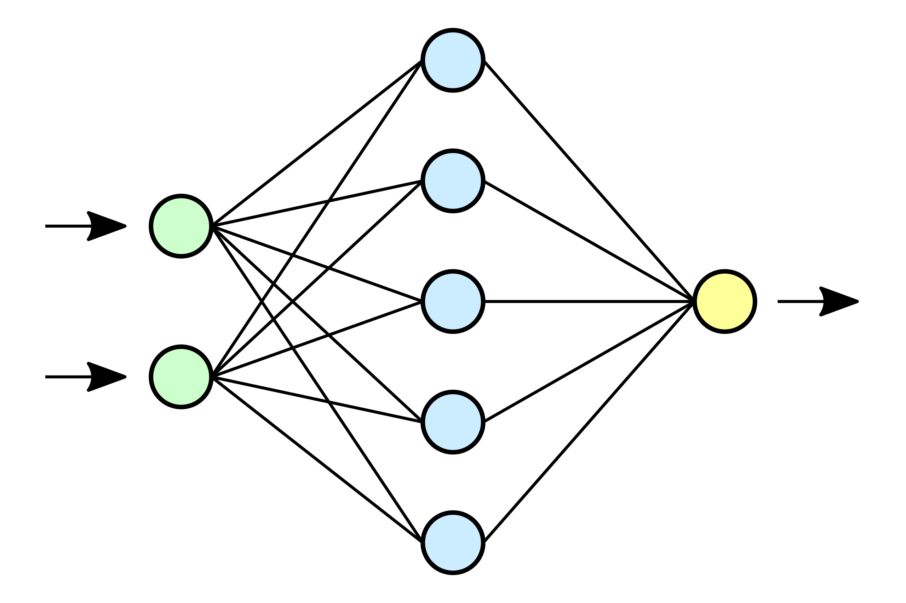
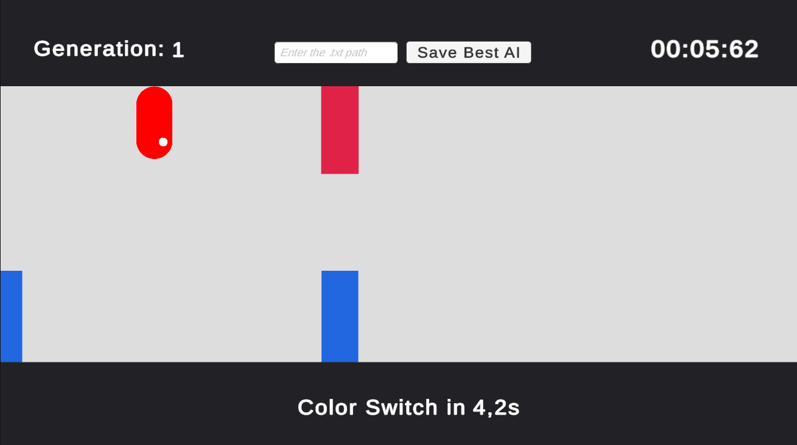
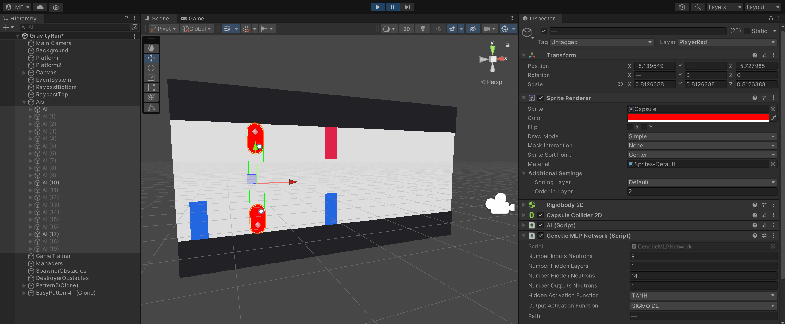

# Machine Learning

 

## Introduction :
---
 **Machine Learning** is a project made on Unity 3D, focused on implementing an Artificial Neural Network to train Artificial Intelligences in a video-game situation.  
 For this project, I choose to implement my neural network in a custom game that I made.  
 This project has been made by **ERBISTI Matéo**, programming student at Isart Digital Paris.  
 The project started on **December 1st** and finished on **January 2nd**.  

 ## Objectives :
 ---
 At first, my objective was to train AIs in a simple game like **Gravity Guy**, a 2D game where the player always runs forward and can choose to change the gravity to avoid obstacles.  
 So the objective was that the more AIs play, the better they become thanks to their **neural network**.  
 As I succeeded in this objective and that I had some time left, I wanted to make the game a little bit **more complex** and see if AIs could still be good at the game.  
 This is why I implemented a color feature in the game. Each AI and obstacle has one color: Red or Blue. AIs can go through obstacles of the same color as them without being killed.  
 But if they touch an obstacle of the other color, they are instantly killed.   I also made a random timer between 5 and 10 seconds to switch the color of every AI (The timer is displayed on the screen).  
 Adding this feature made the neural network more complex because it had more inputs to take into account.    I wanted to try how AIs will behave with more inputs and if they can still learn well how to play the game.  
  

 ## How to test the project :
 ---

You can open the **TrainedGravityRun** scene to directly have a scene with a trained AI and with the training disabled.   
You can also open the **GravityRun** scene which is the training room for my AIs.  
When playing the game, there is a **Save AI button** at the top of the screen with an Input Field.   The input field allows you to specify a **file's path** to save the neural network (for example `AINetworks/NeuralNetwork.txt`).  
When pressing the Save AI button, it will save one of the remaining AIs so you can wait until there are a few AIs left to save the best ones.  
To load a neural network, click on an **AI game object**, and in the inspector go to the **GeneticMLPNetwork** component and **fill the path variable** with the path of your neural network file (for example `AINetworks/NeuralNetwork.txt`).  
It will then automatically load it when pressing the play button.   
The `AINetworks/NeuralNetwork.txt` already exists and is a trained version of the AI that I got.   You can try it directly to see what results I got. <be>

  ## How did I achieve this :
  ---

  First of all, before starting to make my game project, I created two types of **multi-layered neural networks**: one with **back-propagation** and the other with **genetic algorithms**.   
    
  - ### Back-propagation:
	For the neural network with the **back-propagation**, I mainly inspired myself from the `Artificial Intelligence for Games` book by Ian Millington to create my own network in C#.  
	The book was well explained and allowed me to have a basic neural network quickly which I then improved to have a **multi-layer** neural network with **multiple hidden layers**. I also add new **activation functions** such as the Tanh and ReLU functions.  
  After implementing my own network on Unity, I tested it with some basic cases such as an **XOR operator** and it worked well.  
  
  - ### Genetic Algorithms:
	For this one, I took back the network with the back-propagation and I updated it to make it with **genetic algorithms**.  
	Basically, I deleted the backpropagation to add **crossover and mutation** functions.  
	I choose to do a crossover with a **single cut point** by taking half of the neutrons of parent A by copying their input weights to the new offspring  and by taking the other half from parent B.  
	For the mutation, I added a **mutation rate** between 0 and 1 which will tell the mutation's frequency.   Then when a mutation happens, I simply add a little **random offset** between -0.2 and 0.2 to the input weight to modify it a little bit.  
	I also updated the trainer to make the **selection of the best AIs** with a **fitness function**, choose two parents for each crossover, and create the **new population**.  

  - ### The Game:
	- #### Which Neural Network did I choose?
	After testing those two networks, I had to choose which one I would use for my game and I decided to take the one with **genetic algorithms** for multiple reasons. 
	First of all, it doesn't need to have a training set or to know the expected output depending on each input to correct the weights which is really useful, especially in my type of game.  
	It will simply select the best AIs to create a new population that is supposed to be better than the previous one.  
	Also in my case, choosing the best AIs wasn't difficult, I simply needed to compare how much time they survived so it wasn't a problem for me.  
	When I was doing some tests I also saw that I had good results quicker with genetic algorithms than with the backpropagation.  
	Finally, I also wanted to personally test how genetic algorithms will behave in a video-game situation and if we can have good results with them.  

   
  
  
  ## Results :
  ---

  At first, I made the game without the color system so I didn't have a lot of inputs and I quickly had **great results** with one or more AIs being able to survive for a long time **in approximately 8-10 or fewer generations**.  
  Then I made **the color system** which gave me **more inputs** and this time it can take **a little bit longer to have good results** but AIs are also able to survive for a long time after some generations.  
  As I choose to use genetic algorithms, I always have some AIs that are quite good after a few generations and some others that are still really bad because of bad mutations or crossovers.  
  There are still **some areas that can be improved** such as the crossover and mutation functions that can be done in different ways and may give better results than I have.  
  For example for the crossover, I use the single-point crossover method. 
  It works well, but crossovers can be done in different ways with multiple split points, which may work better.  
  The number of hidden layers and neutrons can also not be the best choice (same things for activation functions).  
  The choice of every input is also something that will have a big impact on the results and this can be an area to improve.  
  
  
  ## Credits :
 ---

 During my researches, I used different websites and videos that you can find here:  
 
 - Artificial Intelligence For Games - Ian Millington - https://theswissbay.ch/pdf/Gentoomen%20Library/Game%20Development/Programming/Artificial%20Intelligence%20for%20Games.pdf
 - Artificial Neural Networks - Medium - https://medium.com/analytics-vidhya/artificial-neural-networks-part-1-role-of-activation-function-weights-and-bias-b4b485e581b9  
										https://medium.com/analytics-vidhya/artificial-neural-networks-part-2-structure-of-a-simple-neural-network-and-its-implementation-72d07166e4ab
 - An introduction to genetic algorithms for neural networks - Richard Kemp - https://www.phase-trans.msm.cam.ac.uk/2006/ga_html_files/ga.html#:~:text=The%20mutation%20rate%20is%20the,%CE%B4%CF%83%20of%20a%20gene%20value.
 - Machine Learning for Flappy Bird using Neural Network & Genetic Algorithm - Srdjan Susnic - https://www.youtube.com/watch?v=aeWmdojEJf0&ab_channel=SrdjanSusnic  
 https://www.askforgametask.com/tutorial/machine-learning-algorithm-flappy-bird/
 - Genetic Algorithms Explained By Example - Kie Codes - https://www.youtube.com/watch?v=uQj5UNhCPuo&t=582s&ab_channel=KieCodes
 -  Neuroevolution: Crossover and Mutation : The Nature of Code - The Coding Train - https://www.youtube.com/watch?v=kCx2DElEpP8&t=832s&ab_channel=TheCodingTrain
